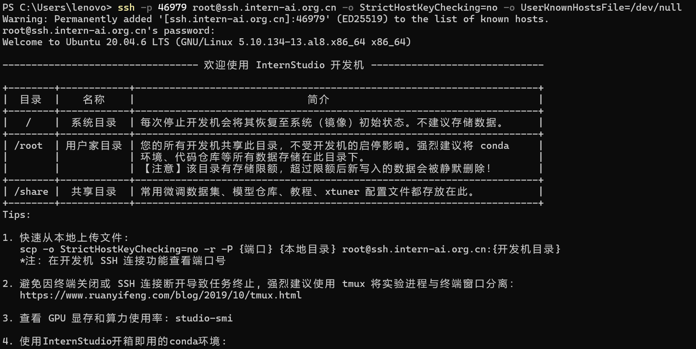
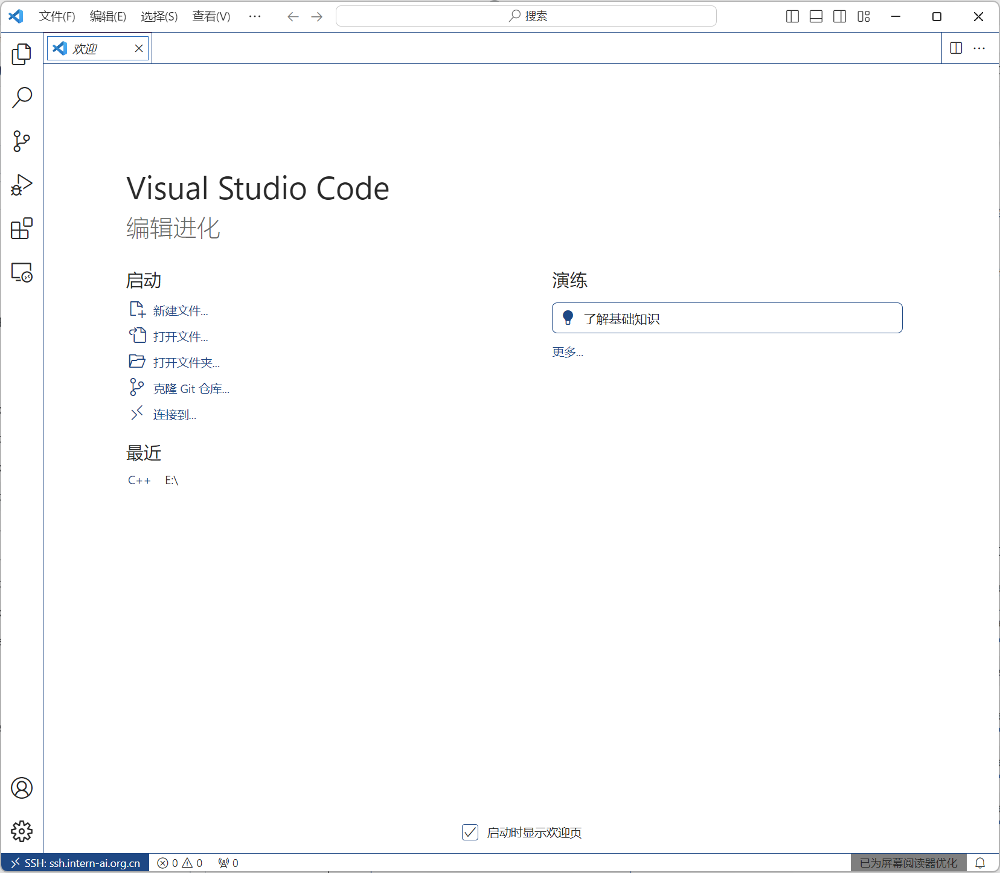
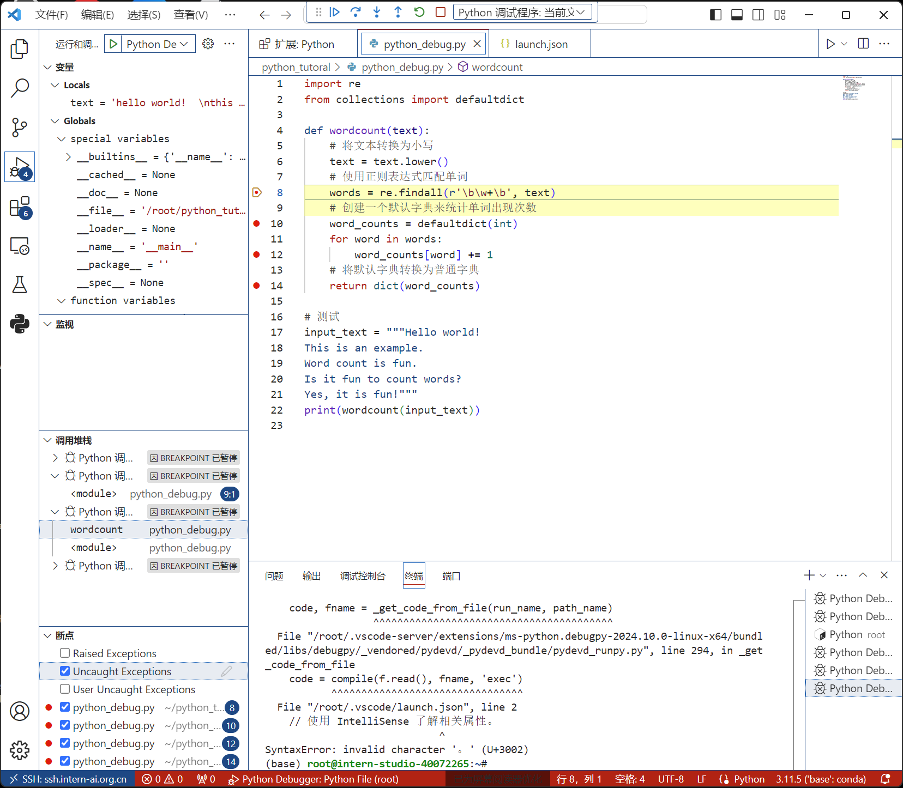

# 【书生·浦语大模型实战营】 作业
## Linux 作业
* 完成SSH连接与端口映射并运行hello_world.py

**结果：**  
* SSH连接

* 端口映射


## Python 作业
**结果：**
* Python实现WordCount
```python
def wordcount(text):
    # 将文本转换为小写
    text = text.lower()
    # 使用正则表达式匹配单词
    words = re.findall(r'\b\w+\b', text)
    # 创建一个默认字典来统计单词出现次数
    word_counts = defaultdict(int)
    for word in words:
        word_counts[word] += 1
    # 将默认字典转换为普通字典
    return dict(word_counts)
```


* Vscode连接InternStudio debug  
本地vscode连接远程开发机  

VScode debug


